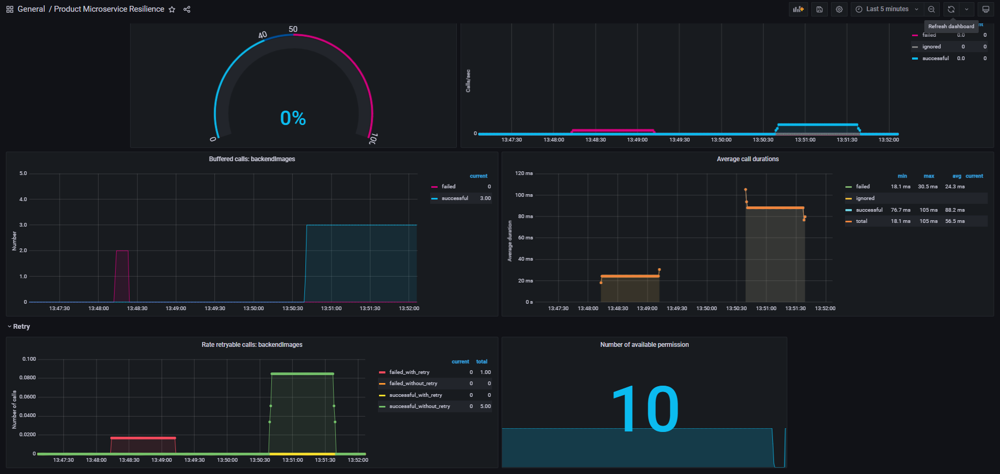

# Microservice Resilience POC with Spring Boot and Resilience4j

This project is a Proof of Concept (POC) for testing microservice resilience using Spring Boot and Resilience4j. It demonstrates the implementation of circuit breaker, rate limiter, and retry patterns to enhance the resilience of microservices. The project is also configured with Prometheus and Grafana for monitoring purposes.

## Microservices

The POC consists of two microservices:

1. **FileHandler Microservice:** This microservice is responsible for saving files to a blob storage. 
It demonstrates custom logic to showcase how resilience works. 

The logic is as follows: 
- it only accepts image files of type PNG. 
- If a file of another type is received, it generates an error with the status code **UNSUPPORTED_MEDIA_TYPE**. 
- If the size of the PNG image is greater than 500 KB, it generates a **GATEWAY_TIMEOUT** exception. 
- Otherwise, it returns a success status code (200).

2. **Product Manager Microservice:** This microservice handles products and their management. It provides endpoints to create products and add product images. The microservice is also configured with Resilience4j to enhance resilience.

## Resilience4j Configuration

The Product Manager Microservice is configured with Resilience4j to add resilience to its endpoints. The following configurations are applied:

- **Rate Limiter:** The endpoint for creating products (POST /product) is configured with a rate limiter. It allows a maximum of 10 calls per second.

- **Circuit Breaker:** The call to the FileHandler Microservice is protected with a circuit breaker. If the rate of calls returning UNSUPPORTED_MEDIA_TYPE exceeds 50%, the circuit breaker will open, preventing further calls.

- **Retry Pattern:** If a timeout exception occurs when calling the FileHandler Microservice, the retry pattern is applied. The microservice will retry the API call two more times before considering it a failure.

## Monitoring with Prometheus and Grafana

The project is configured with Prometheus and Grafana for monitoring the microservices. Prometheus collects and stores metrics, while Grafana provides a visual dashboard to monitor and analyze the metrics. You can use the provided Grafana dashboard to gain insights into the resilience of the microservices.

    
    

## Getting Started

These instructions will get you a copy of the project up and running on your local machine for development and testing purposes.

### Prerequisites

- Docker
- Docker Compose
- Java 8 or higher

### Installation

1. Clone the repository.
`git clone https://github.com/Cherni-Oussama/Microservice-resilience-with-spring-boot-resilience4j-and-prometheus.git`

2. Build and run all containers in docker compose file.
`docker compose up`

3. Access the microservices' endpoints to test the resilience mechanisms.
- **FileHandler:** `localhost:1234`
- **ProductManager:** `localhost:8080`

4. Monitor the microservices' metrics using Grafana. `localhost:3000`

For more detailed instructions, refer to the documentation provided with each microservice.

## Contributing

Contributions to the project are welcome! If you encounter any issues or have suggestions for improvements, please submit an issue or pull request.

## License

This project is licensed under the [MIT License](LICENSE).

